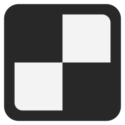

# Tessera Board

**Single page app/game for playing Chess with the aim of being functional, customisable, visually appealing and usable on both mobile and desktop devices and screens.**

## Play

You can play the latest distributed version at https://tessera-board.web.app.

## Development

### IDE setup

\* **I am aware** that this is very basic, but I will include it nevertheless.

---

Software you will need:

- [NodeJS](https://nodejs.org/en/download)
- [Git](https://git-scm.com/downloads)
- [VSCodium](https://github.com/VSCodium/vscodium/releases/latest) or [VSCode](https://code.visualstudio.com/).

\* It's possible that there may be alternative approaches or software also able to achieve desired task.

---

Install [Vue Volar](https://marketplace.visualstudio.com/items?itemName=Vue.volar) and [Vue Typescript](https://marketplace.visualstudio.com/items?itemName=Vue.vscode-typescript-vue-plugin) plugins for VSCode.

---

Open whatever projects folder you want the project to be in. In console execute:

- `git clone https://github.com/FrameXX/tessera-board.git` to copy all files from github repo
- `cd tessera-board` to go into folder of the specific project
- `npm install` to install all dependencies
- `npm run dev` to start a localhost server

#### Note on `landev` script

The `landev` script in package.json is configured to start a server on the local network. It can be executed by executing `npm run landev` in project root. Starting a "lan server" is useful for debugging on a mobile phone or other devices connected to the same network, but the IP address in the command is hardcoded. Therefore, you must modify the command to utilise the IP address of your device on your network, which varies on each network or you will come across an error.

### Build

Execute `npm run build` to run Vue and Vite build process.

## License

This software is licensed under [GNU Affero General Public License v3](https://www.gnu.org/licenses/agpl-3.0.en.html).
